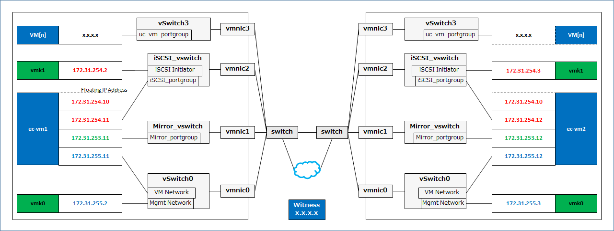

# HAUC setup howto

This guide provides how to set up HAUC (Highly Available Unified Communications). The guide assumes its readers to have Linux system administration knowledge and skills with experience in installation and configuration of Storages, and Networks.

## Overview

The general procedure to deploy HAUC on ESXi boxes (Primary and Standby) consists of the following major steps:

1. Perform system planning to determine requirements and specify specific configuration settings.
2. Set up Primary and Standby ESXi.
3. Deploy *iSCSI Target Cluster*.
4. Connect ESXi hosts to the iSCSI Target.
5. Deploy UC VMs.
6. Deploy *vMA Cluster* which managing UC VMs.
    

## Versions
- vSphere ESXi 6.7
- Strawberry Perl 5.30.0.1 (64bit)   (http://strawberryperl.com/)
- EXPRESSCLUSTER X 4.1 for Linux (4.1.1-1)

## System Requirements and Planning

* Requirement for 2 Physical ESXi servers

  | Portion	| Description 
  |:--		|:--
  | CPU Cores	| (Cores for VMkernel) + (Cores for UC VMs) +   (4 Cores for iSCSI VM) + (2 Cores for vMA VM)
  | Memory	| (2GB for VMkernel) + (required amount for UC   VMs) + (8GB for iSCSI VM) + (4GB for vMA VM)
  | LAN Port	| 4 LAN ports (iSCSI, ECX data-mirroring,   Management, UC)
  | Storage	| (60GB for ESXi system) + (required amount   for UC VMs) + (6GB for iSCSI VM) + (6GB for vMA VM)

* Network configuration
  

* ESXi configuration

  |							|   Primary ESXi			| Secondary ESXi	  	|
  |:---							|:---  					|:---			  	|
  | IP address for Management				|   172.31.255.2			| 172.31.255.3		  	|
  | IP address for VMkernel(Software iSCSI Adapter)	|   172.31.254.2			| 172.31.254.3		  	|
  | iSCSI Initiator WWN					|   iqn.1998-01.com.vmware:1		|  iqn.1998-01.com.vmware:2 	|
  
## Procedure

### Preparing 64bit Windows PC
- Download [**hauc-master.zip**](https://github.com/mkazuyuki/hauc/archive/master.zip) and extract.
- Download [**ECX**](https://www.nec.com/en/global/prod/expresscluster/en/trial/zip/ecx41l_x64.zip)
	-  Extract it and copy *expresscls-4.1.1-1.x86_64.rpm* in it to the subfolder *cf*.
- Put the (trial) license files of ECX to the subfolder *cf*.
	- ECX4.x-lin1.key
	- ECX4.x-Rep-lin1.key
	- ECX4.x-Rep-lin2.key
- Download
	[putty](https://the.earth.li/~sgtatham/putty/latest/w64/putty.exe),
	[plink](https://the.earth.li/~sgtatham/putty/latest/w64/plink.exe),
	[pscp](https://the.earth.li/~sgtatham/putty/latest/w64/pscp.exe)
  to the subfolder *cf*.
- Download and install [Strawberry Perl](http://strawberryperl.com/).
- Configure the Windows PC so that become IP reachable to **172.31.255.0/24** network.
- Download CetOS 7.6 (CentOS-7-x86_64-DVD-1810.iso) and put it on /vmfs/volumes/datastore1/iso of ESXi#1 and ESXi#2.

### Setting up ESXi - Network

Install vSphere ESXi then set up IP address as following.

|		| Primary ESXi	| Secondary ESXi	|
|:---		|:---		|:---			|
| Management IP	| 172.31.255.2	| 172.31.255.3		|

Start ssh service and configure it to start automatically.
- Open vSphere Host Client for ESXi#1 (http://172.31.255.2/) and ESXi#2 (http://172.31.255.3/)
  - [Manage] in [Navigator] pane > [Services] tab
    - [TSM-SSH] >  [Actions] > [Start]
    - [TSM-SSH] >  [Actions] > [Polilcy] > [Start and stop with host]

Configure vSwitch, Physical NICs, Port groups, VMkernel NIC for iSCSI Initiator
- Run *cf-esxi-phase1.pl* in subfolder *cf*.

### Deploy [iSCSI Cluster](iSCSI-cluster.md) on both ESXi

- Create VMs (iSCSI1 on ESXi#1, iSCSI2 on ESXi#2).

  The disk size of the iSCSI Target which will be an ESXi Datastore can be specified at the line of **my $iscsi_size	= "20G";** in *cf-iscsi-phase1.pl* in the subfolder *cf*.  
  e.x.

		my $iscsi_size	= "1024G";

  Run *cf-iscsi-phase1.pl* in subfolder *cf*.

- Boot VMs and install CentOS to them.

  What needed is to select sda as *INSTALLATION DESTINATION* and setting *ROOT PASSWORD*.

- Configure the first network of VMs

  Open ESXi Host Client, open iSCSI VMs console and login to them, then run the below command to set IP address so that Windows client can access to the VMs.

  - on iSCSI1 console:

		nmcli c m ens192 ipv4.method manual ipv4.addresses 172.31.255.11/24 connection.autoconnect yes

  - on iSCSI2 console:

		nmcli c m ens192 ipv4.method manual ipv4.addresses 172.31.255.12/24 connection.autoconnect yes

- Configure VMs

  Run *cf-iscsi-phase2.pl* in the subfolder *cf*.

  When you get questioned like below, push "y" then enter key.

		2019/09/02 09:26:44 [D] | WARNING - POTENTIAL SECURITY BREACH!
		2019/09/02 09:26:44 [D] | The server's host key does not match the one PuTTY has
		2019/09/02 09:26:44 [D] | cached in the registry. This means that either the
		2019/09/02 09:26:44 [D] | server administrator has changed the host key, or you
		2019/09/02 09:26:44 [D] | have actually connected to another computer pretending
		2019/09/02 09:26:44 [D] | to be the server.
		2019/09/02 09:26:44 [D] | The new ssh-ed25519 key fingerprint is:
		2019/09/02 09:26:44 [D] | ssh-ed25519 255 08:5c:13:b2:6a:24:a2:49:ea:d4:dd:a0:b7:be:8f:85
		2019/09/02 09:26:44 [D] | If you were expecting this change and trust the new key,
		2019/09/02 09:26:44 [D] | enter "y" to update PuTTY's cache and continue connecting.
		2019/09/02 09:26:44 [D] | If you want to carry on connecting but without updating
		2019/09/02 09:26:44 [D] | the cache, enter "n".
		2019/09/02 09:26:44 [D] | If you want to abandon the connection completely, press
		2019/09/02 09:26:44 [D] | Return to cancel. Pressing Return is the ONLY guaranteed
		2019/09/02 09:26:44 [D] | safe choice.

  After the completion of *cf-iscsi-phase2.pl*, both VMs are rebooted.
  Wait the completion of the reboot.

- Configur iSCSI Target on the cluster

On the client PC, run *cf-iscsi-phase3.pl* in the subfolder *cf*.

After the completion of *cf-iscsi-phase3.pl*, both iscsi1 and iscsi2 are rebooted.
Open ECX WebUI (http://172.31.255.11:29003) and wait for the cluster to start the failover group "*failover-iscsi*".

### Setting up ESXi - iSCSI Initiator
- Run *cf-esxi-phase2.pl* in subfolder *cf*.
  After running the command, the iSCSI datastore which the iSCSI Cluster provides can be accessible from both ESXi,

### Deploying UC VMs on iSCSI datastore
- Deploy UC VMs (to be protected by ECX) on *esxi1* or *esxi2*.
  These VMs should be deployed on the iSCSI datastore.

### Deploying [vMA Cluster](vMA-cluster.md) on both ESXi

- Create VMs (vMA1 on ESXi#1, vMA2 on ESXi#2).

  Run *cf-vma-phase1.pl* in subfolder *cf*.

- Boot VMs and install CentOS to them.

  What needed is to select sda as *INSTALLATION DESTINATION* and setting *ROOT PASSWORD*.

- Configure the first network of VMs

  Open ESXi Host Client, open vMA VMs console and login to them, then run the below command to set IP address so that Windows client can access to the VMs.

  - on vMA1 console:

		nmcli c m ens160 ipv4.method manual ipv4.addresses 172.31.255.6/24 connection.autoconnect yes

  - on vMA2 console:

		nmcli c m ens160 ipv4.method manual ipv4.addresses 172.31.255.7/24 connection.autoconnect yes

- Configure VMs

  Run *cf-vma-phase2.pl* in the subfolder *cf*.

  When you get questioned like below, push "y" then enter key.

		2019/09/02 09:26:44 [D] | WARNING - POTENTIAL SECURITY BREACH!
		2019/09/02 09:26:44 [D] | The server's host key does not match the one PuTTY has
		2019/09/02 09:26:44 [D] | cached in the registry. This means that either the
		2019/09/02 09:26:44 [D] | server administrator has changed the host key, or you
		2019/09/02 09:26:44 [D] | have actually connected to another computer pretending
		2019/09/02 09:26:44 [D] | to be the server.
		2019/09/02 09:26:44 [D] | The new ssh-ed25519 key fingerprint is:
		2019/09/02 09:26:44 [D] | ssh-ed25519 255 08:5c:13:b2:6a:24:a2:49:ea:d4:dd:a0:b7:be:8f:85
		2019/09/02 09:26:44 [D] | If you were expecting this change and trust the new key,
		2019/09/02 09:26:44 [D] | enter "y" to update PuTTY's cache and continue connecting.
		2019/09/02 09:26:44 [D] | If you want to carry on connecting but without updating
		2019/09/02 09:26:44 [D] | the cache, enter "n".
		2019/09/02 09:26:44 [D] | If you want to abandon the connection completely, press
		2019/09/02 09:26:44 [D] | Return to cancel. Pressing Return is the ONLY guaranteed
		2019/09/02 09:26:44 [D] | safe choice.

  After the completion of *cf-vma-phase2.pl*, both VMs are rebooted.
  Wait the completion of the reboot.

- Configur vMA Cluster

  Run *cf-vma-phase3.pl* in the subfolder *cf*.

After the completion of *cf-vma-phase3.pl*, both vma1 and vma2 start controlling UC VMs.
Open ECX WebUI (http://172.31.255.6:29003) and wait for the cluster to start.

----

## Common Maintenance Tasks

### The graceful shutdown procedure for both ESXi
1. Issue cluster shutdown for the vMA Cluster. Then all the UC VMs and vMA VMs are shutted down.
2. Issue cluster shutdown for the iSCSI Cluster. Then both iSCSI Target VMs are shutted down.
3. Issue shutdown for both the ESXi.

### Stopping either of nodes in vMA Cluster or iSCSI Target Cluster
- When intentionally shutdown the vMA VM or iSCSI VM, "suspend" the *genw-remote-node* before it. *genw-remote-node* in the Cluster periodically executes "power on" for another VM. 
- When intentionally stop the cluster service, "suspend" the *genw-remote-node* before it. *genw-remote-node* in the cluster periodically executes "starting cluster service" for another VM.

### Deleting / Adding UC VM on vMA Cluster
- re-run the *cf-vma-phase3.pl*

## Where to go for more information

For any further information, please visit the [EXPRESSCLUSTER web-site](http://www.nec.com/expresscluster)

[The following guides are available](http://www.nec.com/global/prod/expresscluster/en/support/manuals.html) for instant support:  

- Getting Started Guide - General cluster concepts and overview of EXPRESSCLUSTER functionality.

- Installation Guide - EXPRESSCLUSTER installation and configuration procedures in detail.

- Reference Guide - The reference of commands that can be put in EXPRESSCLUSTER scripts and maintenance commands that can be executed from the server command prompt.

<!--

----

## Disclaimer

NEC Corporation assumes no responsibility for technical or editorial mistakes in or omissions from this document. To obtain the benefits of the product, it is the customers responsibility to install and use the product in accordance with this document. The copyright for the contents of this document belongs to NEC Corporation.

## Revision history

- 2017.08.28 Miyamoto Kazuyuki	1st issue
- 2018.10.22 Miyamoto Kazuyuki	2nd issue
- 2019.06.27 Miyamoto Kazuyuki	3rd issue

-->
