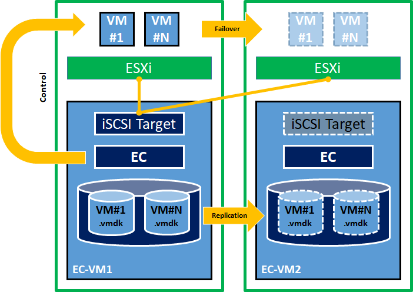

# HAUC setup howto

This guide introduces HAUC and its set up. The guide assumes its readers to have Linux system administration knowledge and skills with experience in installation and configuration of Storages, and Networks.

## Overview

**HAUC** is the name for **H**ighly **A**vailable **U**nified **C**ommunication solution by EXPRESSCLUSTER.
It provides the high-availability and protection for virtual machines where UC products are running on.
It is made of 2 IA server boxes, vSphere ESXi, UC products running on Linux or Windows VM (SV9500, UCE and others), CentOS and EXPRESSCUSTER X for Linux.

* Architecture
	

2 boxes of green line stand for 2 of IA servers. ESXi is installed on both servers.  
The *iSCSI Cluster* in the bottom half provides the iSCSI storage for both ESXi and becomes a Datastore for storing the configuration and disk-image files for UC VMs on it.
The iSCSI storage is made by 2 VMs where *iSCSI Target service* runs on CentOS and EXPRESSCLUSTER (data-mirroring configuration) protects it.  
The *vMA Cluster* in the upper half provides the protection for UC VMs by controlling and monitoring them. When EXPRESSCLUSTER in the vMA Cluster detects an error on the active system (left side), it issues failover of UC VMs (SV95 and UCE).
 
The general procedure to deploy HAUC consists of the following major steps:

1. Perform system planning to determine requirements and specify specific configuration settings.
2. Set up Primary and Standby ESXi.
3. Deploy *iSCSI Target Cluster* and *vMA Cluster*.
4. Connect ESXi hosts to the iSCSI Target.
5. Deploy UC VMs.
6. Configure *vMA Cluster* to manage the UC VMs. 

## Software Requirements

- vSphere ESXi 6.0 or later (6.7 U2 was verified)
- EXPRESSCLUSTER X 4.1 for Linux (4.1.1-1)
	- EXPRESSCLUSTER X Replicator 4.1 for Linux (4.1.1-1)
- CentOS 7.6 x86_64
- Strawberry Perl 5.30.0.1 (64bit)   (http://strawberryperl.com/)
- putty, plink, pscsp

## System Requirements and Planning

* Requirement for 2 Physical servers

  | Portion	| Description 
  |:--		|:--
  | CPU Cores	| (Cores for VMkernel) + (Cores for UC VMs) + (4 Cores for iSCSI VM) + (2 Cores for vMA VM)
  | Memory	| (2GB for VMkernel) + (required amount for UC VMs) + (8GB for iSCSI VM) + (4GB for vMA VM)
  | LAN Port	| LAN ports x4 (GBE required, 10GBE recommended)
  | Storage	| (60GB for ESXi system) + (required amount for UC VMs) + (9GB for iSCSI VM) + (6GB for vMA VM)

* Network configuration
  

* ESXi configuration

  |							|   Primary ESXi			| Secondary ESXi	  	|
  |:---							|:---  					|:---			  	|
  | IP address for Management				|   172.31.255.2			| 172.31.255.3		  	|
  | IP address for VMkernel(Software iSCSI Adapter)	|   172.31.254.2			| 172.31.254.3		  	|
  | iSCSI Initiator WWN					|   iqn.1998-01.com.vmware:1		|  iqn.1998-01.com.vmware:2 	|

## [Procedure](procedure.md)

## Common Maintenance Tasks

### The graceful shutdown procedure for both ESXi
1. Issue cluster shutdown for the vMA Cluster. Then all the UC VMs and vMA VMs are shutted down.
2. Issue cluster shutdown for the iSCSI Cluster. Then both iSCSI Target VMs are shutted down.
3. Issue shutdown for both the ESXi.

### Stopping either of nodes in vMA Cluster or iSCSI Target Cluster
- When intentionally shutdown the vMA VM or iSCSI VM, "suspend" the *genw-remote-node* before it. *genw-remote-node* in the Cluster periodically executes "power on" for another VM. 
- When intentionally stop the cluster service, "suspend" the *genw-remote-node* before it. *genw-remote-node* in the cluster periodically executes "starting cluster service" for another VM.

### Deleting / Adding UC VM on vMA Cluster
- re-run the *cf-vma-phase3.pl*

## Where to go for more information

For general information about EXPRESSCLUSTER, please visit the product [web site](http://www.nec.com/expresscluster).

[The following guides are available](http://www.nec.com/global/prod/expresscluster/en/support/manuals.html) for instant support:  

- Getting Started Guide - General cluster concepts and overview of EXPRESSCLUSTER functionality.

- Installation Guide - EXPRESSCLUSTER installation and configuration procedures in detail.

- Reference Guide - The reference of commands that can be put in EXPRESSCLUSTER scripts and maintenance commands that can be executed from the server command prompt.

<!--

----

## Disclaimer

NEC Corporation assumes no responsibility for technical or editorial mistakes in or omissions from this document. To obtain the benefits of the product, it is the customers responsibility to install and use the product in accordance with this document. The copyright for the contents of this document belongs to NEC Corporation.

## Revision history

- 2017.08.28 Miyamoto Kazuyuki	1st issue
- 2018.10.22 Miyamoto Kazuyuki	2nd issue
- 2019.06.27 Miyamoto Kazuyuki	3rd issue

-->
