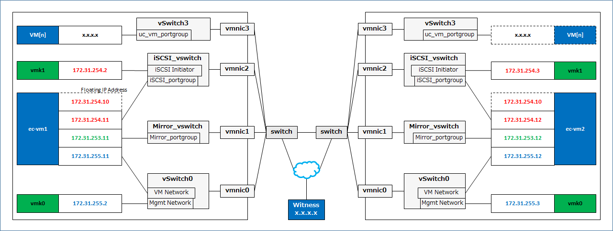

# Howto setup HAUC

This guide provides how to set up HAUC (Highly Available Unified Communications). The guide assumes its readers to have Linux system administration knowledge and skills with experience in installation and configuration of Storages, and Networks.

## Overview

The general procedure to deploy HAUC on two ESXi server machines (Primary and Standby) consists of the following major steps:

1. Perform system planning to determine requirements and specify specific configuration settings.
2. Set up Primary and Standby ESXi.
3. Deploy *iSCSI Target Cluster*
4. Connect ESXi hosts to the iSCSI Target.
5. Deploy UC VMs
6. Deploy and configure *vMA Cluster*.
    

## Versions
- vSphere ESXi 6.7
- Strawberry Perl 5.30.0.1 (64bit)   (http://strawberryperl.com/)

## System Requirements and Planning

### Requirement for 2 Physical ESXi servers

| Portion	| Description 
|:--		|:--
| CPU Cores	| (Cores for VMkernel) + (Cores for UC VMs) + (4 Cores for iSCSI VM) + (2 Cores for vMA VM)
| Memory	| (2GB for VMkernel) + (required amount for UC VMs) + (8GB for iSCSI VM) + (4GB for vMA VM)
| LAN Port	| 4 LAN ports (iSCSI, ECX data-mirroring, Management, UC)
| Storage	| (60GB for ESXi system) + (required amount for UC VMs) + (6GB for iSCSI VM) + (6GB for vMA VM)

### Network configuration

### Nodes configuration

|				| Primary		| Secondary		|
|:---				|:---			|:---			|
| Hostname			| esxi1			| esxi2			|
| root password			| passwd1		| passwd2		|
|				|			|			|
| IP address for Management	| 172.31.255.2		| 172.31.255.3		|
| IP address for VMkernel1(*) 	| 172.31.254.2		| 172.31.254.3		|
| iSCSI Initiator WWN		| iqn.1998-01.com.vmware:1 | iqn.1998-01.com.vmware:2 |

(*) for iSCSI Initiator

## Procedure

### Preparing 64bit Windows PC

- Download and extract the [**Docs-Master.zip**](https://github.com/mkazuyuki/docs/archive/master.zip)
- Install Strawberry Perl
- Download
	[putty](https://the.earth.li/~sgtatham/putty/latest/w64/putty.exe),
	[plink](https://the.earth.li/~sgtatham/putty/latest/w64/plink.exe),
	[pscp](https://the.earth.li/~sgtatham/putty/latest/w64/pscp.exe)
  to the Docs-Master subfolder CF

### Setting up ESXi - Network

Install vSphere ESXi.

- Set up hostname and IP address.

	|		| Primary	| Secondary	|
	|---		|---		|---		|
	| Hostname	| esxi1		| esxi2		|
	| Management IP	| 172.31.255.2	| 172.31.255.3	|

Start ssh service and configure it to start automatically.

- Open vSphere Host Client
  - [Manage] in [Navigator] pane > [Services] tab
    - [TSM-SSH] >  [Actions] > [Start]
    - [TSM-SSH] >  [Actions] > [Polilcy] > [Start and stop with host]

Configure ESXi network : vSwitch, Physical NICs, Port groups, VMkernel NIC for iSCSI Initiator

  - Connect to esxi1 by putty then run the below shell script.

		#!/bin/sh
		esxcfg-vswitch -a Mirror_vswitch
		esxcfg-vswitch -a iSCSI_vswitch
		esxcfg-vswitch -a uc_vm_vswitch
		esxcfg-vswitch -L vmnic1 Mirror_vswitch
		esxcfg-vswitch -L vmnic2 iSCSI_vswitch
		esxcfg-vswitch -L vmnic3 uc_vm_vswitch
		esxcfg-vswitch -A Mirror_portgroup Mirror_vswitch
		esxcfg-vswitch -A iSCSI_portgroup iSCSI_vswitch
		esxcfg-vswitch -A iSCSI_Initiator iSCSI_vswitch
		esxcfg-vswitch -A uc_vm_portgroup uc_vm_vswitch
		esxcfg-vmknic -a -i 172.31.254.2 -n 255.255.255.0 iSCSI_Initiator
		/etc/init.d/hostd restart

  - Connect to esxi2 by putty then run the below shell script.

		#!/bin/sh
		esxcfg-vswitch -a Mirror_vswitch
		esxcfg-vswitch -a iSCSI_vswitch
		esxcfg-vswitch -a uc_vm_vswitch
		esxcfg-vswitch -L vmnic1 Mirror_vswitch
		esxcfg-vswitch -L vmnic2 iSCSI_vswitch
		esxcfg-vswitch -L vmnic3 uc_vm_vswitch
		esxcfg-vswitch -A Mirror_portgroup Mirror_vswitch
		esxcfg-vswitch -A iSCSI_portgroup iSCSI_vswitch
		esxcfg-vswitch -A iSCSI_Initiator iSCSI_vswitch
		esxcfg-vswitch -A uc_vm_portgroup uc_vm_vswitch
		esxcfg-vmknic -a -i 172.31.254.3 -n 255.255.255.0 iSCSI_Initiator
		/etc/init.d/hostd restart

### Deploying iSCSI VMs on each ESXi
- Re-open vSphere Host Client
- Deploy iSCSI Cluster on both ESXi and boot them.

### Setting up ESXi - iSCSI Initiator
  - Connect to ESXi-A by putty then run the below shell script.

		#!/bin/sh

		IQN='iqn.1998-01.com.vmware:1'
		ADDR='172.31.254.10:3260'

		# Enabling iSCSI Initiator
		esxcli iscsi software set --enabled=true
		VMHBA=`esxcli iscsi adapter list | grep 'iSCSI Software Adapter' | sed -r 's/\s.*iSCSI Software Adapter$//'`
		esxcli iscsi adapter set -n ${IQN} -A ${VMHBA}
		esxcli iscsi adapter discovery sendtarget add --address=${ADDR} --adapter=${VMHBA}
		esxcli storage core adapter rescan --all

		# Create then format the partition
		i=1
		for DEVICE in `esxcli storage core device list | grep "Display Name: LIO-ORG" | sed -r 's/^.*\((.*)\)/\1/' | xargs`; do
			END_SECTOR=$(eval expr $(partedUtil getptbl /vmfs/devices/disks/${DEVICE} | tail -1 | awk '{print $1 " \\* " $2 " \\* " $3}') - 1)
			partedUtil setptbl "/vmfs/devices/disks/${DEVICE}" "gpt" "1 2048 ${END_SECTOR} AA31E02A400F11DB9590000C2911D1B8 0"
			/sbin/vmkfstools -C vmfs5 -b 1m -S iSCSI${i}  /vmfs/devices/disks/${DEVICE}:1
			i=$(($i + 1))
		done

  - Connect to ESXi-B by ssh client then run the below shell script.

		#!/bin/sh

		IQN='iqn.1998-01.com.vmware:2'
		ADDR='172.31.254.10:3260'

		# Enabling iSCSI Initiator
		esxcli iscsi software set --enabled=true
		VMHBA=`esxcli iscsi adapter list | grep 'iSCSI Software Adapter' | sed -r 's/\s.*iSCSI Software Adapter$//'`
		esxcli iscsi adapter set -n ${IQN} -A ${VMHBA}
		esxcli iscsi adapter discovery sendtarget add --address=${ADDR} --adapter=${VMHBA}
		esxcli storage core adapter rescan --all

### Deploying UC VMs on iSCSI datastore

- Deploy UC VMs (to be protected by ECX) on *esxi1* or *esxi2*.
  These VMs should be deployed on the iSCSI datastore.

### Deploying vMA VMs on each ESXi
- Deploy vMA OVA on both ESXi and boot them.

### Configuring vMA Cluster

On the client

- Run *cf.pl* in cf folder. 

----

## Common Maintenance Tasks

### The graceful shutdown procedure for both ESXi
1. Issue cluster shutdown for the vMA Cluster. Then all the UC VMs and vMA VMs are shutted down.
2. Issue cluster shutdown for the iSCSI Cluster. Then both iSCSI Target VMs are shutted down.
3. Issue shutdown for both the ESXi.

### Stopping either of nodes in vMA Cluster or iSCSI Target Cluster
- When intentionally shutdown the vMA VM or iSCSI VM, "suspend" the *genw-remote-node* before it. *genw-remote-node* in the Cluster periodically executes "power on" for another VM. 
- When intentionally stop the cluster service, "suspend" the *genw-remote-node* before it. *genw-remote-node* in the cluster periodically executes "starting cluster service" for another VM.

### Deleting / Adding UC VM on vMA Cluster
- re-run the *cf.pl*

## Where to go for more information

For any further information, please visit the EXPRESSCLUSTER web-site at

http://www.nec.com/expresscluster

The following guides are available for instant support:  

- Getting Started Guide - This guide explains general cluster concepts and overview of EXPRESSCLUSTER functionality.

- Installation Guide - This guide explains EXPRESSCLUSTER installation and configuration procedures in detail.

- Reference Guide - This is a reference of commands that can be put in EXPRESSCLUSTER scripts and maintenance commands that can be executed from the server command prompt.

The guides stated in above can be found at:

http://www.nec.com/global/prod/expresscluster/en/support/manuals.html

----

## Disclaimer

NEC Corporation assumes no responsibility for technical or editorial mistakes in or omissions from this document. To obtain the benefits of the product, it is the customer’s responsibility to install and use the product in accordance with this document. The copyright for the contents of this document belongs to NEC Corporation.

## Revision history

- 2017.08.28 Miyamoto Kazuyuki	1st issue
- 2018.10.22 Miyamoto Kazuyuki	2nd issue
- 2019.06.27 Miyamoto Kazuyuki	3rd issue